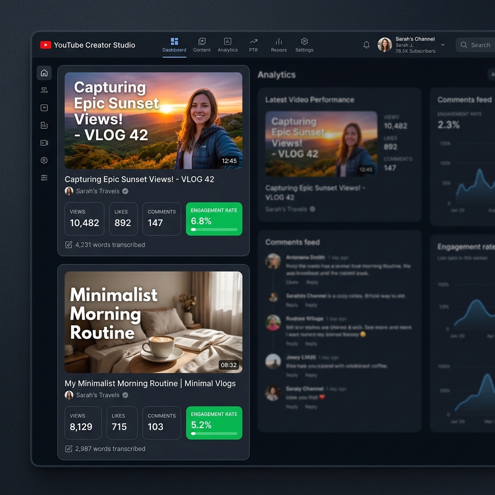
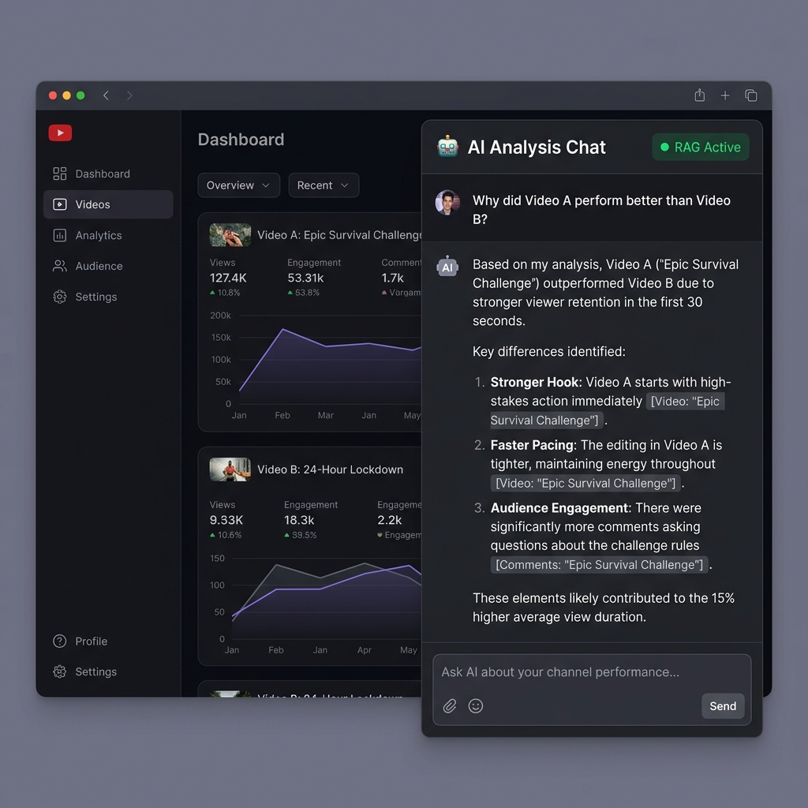

# 🎬 CreatorLens


CreatorLens is a full-stack Retrieval-Augmented Generation (RAG) chatbot designed for YouTube video analysis. It allows content creators to compare the performance of two YouTube videos by analyzing their transcripts, engagement metrics, and structure. Creators can chat directly with an AI assistant to uncover actionable insights about why certain videos perform better, focusing on hooks, pacing, and audience retention.

## 🏗 Architecture Diagram

```
User Input (2 YouTube URLs)
       │
       ▼
[ Next.js API (/api/analyze) ] ───(Fetch Metadata & Transcript)──▶ YouTube Data API
       │
       ▼
[ Transformers.js Embedder ] ───(Chunk & Embed text locally)
       │
       ▼
[ ChromaDB Vector Store ] ◀───(Store embeddings)
       │
       ▼
User Chat Query
       │
       ▼
[ Next.js API (/api/chat) ] ───(Embed query)──▶ Transformers.js
       │
       ▼
[ ChromaDB Vector Store ] ───(Retrieve top chunks)
       │
       ▼
[ Groq API (LLaMA-3.3-70b) ] ───(Generate streaming response)
       │
       ▼
User UI (Streaming Chat + Citations)
```

## 🛠 Stack & Choices

*   **Next.js (App Router)**: Provides a seamless full-stack developer experience, Server-Sent Events (SSE) for chat streaming, and easy deployment.
*   **Groq API (LLaMA-3.3-70b)**: Chosen over OpenAI — 10x faster token generation via LPU architecture. At 1,000 creators/day, latency directly impacts UX and cost.
*   **LangChain (RecursiveCharacterTextSplitter + PromptTemplate)**: Handles intelligent text chunking with overlap and structured prompt management for the RAG pipeline.
*   **ChromaDB**: An easy-to-use, open-source local vector database perfect for rapid prototyping and storing transcript chunk embeddings.
*   **Transformers.js**: Chosen over OpenAI embeddings — zero per-call cost, runs entirely in Node.js. At scale this saves hundreds of dollars/month.
*   **Tailwind CSS**: For rapid, utility-first UI styling and dark mode aesthetics.

## 🚀 How to Run Locally

1.  **Clone the repository:**
    ```bash
    git clone https://github.com/SantoshMalana/CreatorLens.git
    cd creatorlens
    ```

2.  **Install Dependencies:**
    ```bash
    npm install
    ```

3.  **Configure Environment Variables:**
    Copy `.env.example` to `.env.local` and add your keys:
    ```env
    YOUTUBE_API_KEY=your_youtube_api_key
    GROQ_API_KEY=your_groq_api_key
    ```

4.  **Run ChromaDB Locally:**
    In a separate terminal, start the Chroma vector database:
    ```bash
    pip install chromadb
    chroma run --path ./chroma_data
    ```

5.  **Start the Next.js Development Server:**
    ```bash
    npm run dev
    ```
    Open `http://localhost:3000` in your browser.

## 🧠 Design Decisions

*   **Chunking Strategy**: We use a `chunkSize` of 500 words with an `overlap` of 50 words. This ensures that context isn't lost across chunk boundaries while keeping the payload size reasonable for the embedding model and LLM context window.
*   **Embedding Model**: `Xenova/all-MiniLM-L6-v2` is used via Transformers.js. It's lightweight enough to run locally without GPU acceleration while providing high-quality semantic embeddings.
*   **Why Groq?**: The primary value of a chat interface is speed. Groq's LPU architecture delivers tokens significantly faster than traditional GPU providers, creating a fluid, conversational experience.

## 📈 Scalability Notes

To scale CreatorLens for 1000+ creators per day:
1.  **Vector DB Migration**: Move from local ChromaDB to a managed vector database (like Pinecone, Qdrant Cloud, or Supabase pgvector) to handle concurrent reads/writes and larger datasets.
2.  **Transcript Caching**: Implement Redis to cache fetched transcripts and metadata. If multiple users analyze the same trending video, we avoid redundant YouTube API calls and embedding computations.
3.  **Background Processing**: For long videos (1hr+), extracting and embedding the transcript can cause timeouts. Move the `/api/analyze` logic to a background worker queue (e.g., Inngest, BullMQ) and use WebSockets or polling to notify the client when analysis is ready.
4.  **Edge Functions**: Move the chat route to the Edge (Vercel Edge runtime) to reduce cold boots and stream responses faster globally.

## 📸 Screenshots

<div align="center">
  
  
</div>
